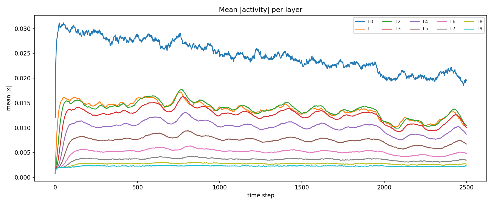
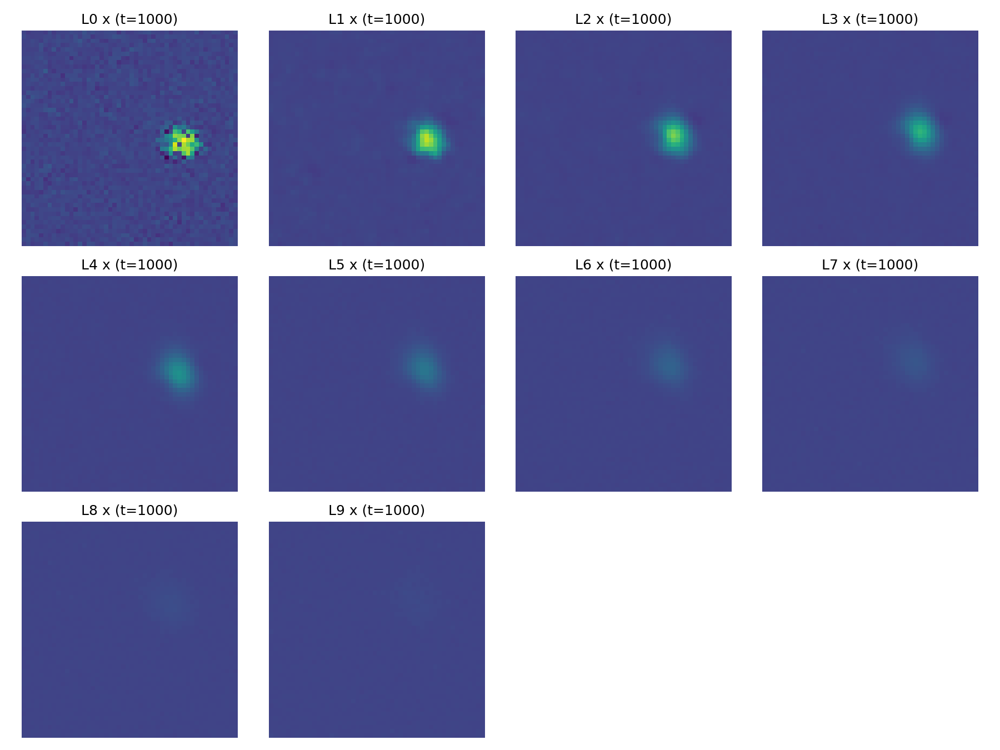
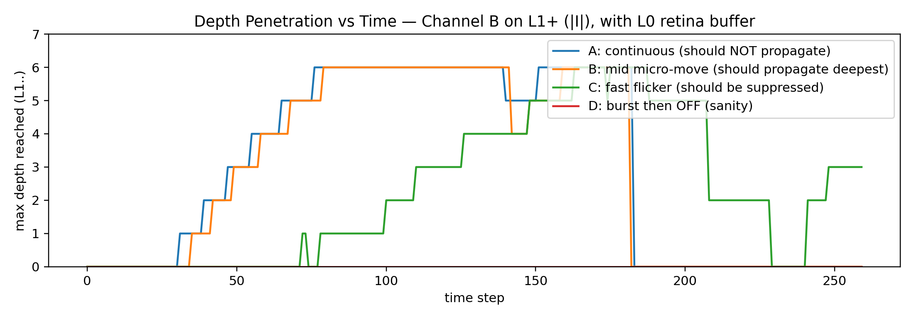
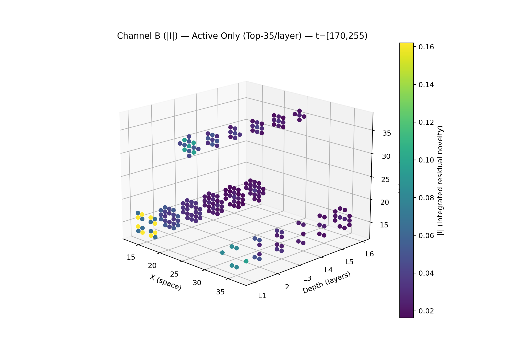

# Frozen Substrate

A bio-inspired computational substrate where a 2D grid of neuron-like cells self-organize through local prediction, plasticity, and survival dynamics. Activity propagates through passive depth layers, creating a persistence filter that selectively passes mid-entropy stimuli.

**Core idea:** *Information = persistence of deviation from expectation under degradation.*

## Usage

```bash
pip install -r requirements.txt

# Run synthetic demo (no dependencies beyond numpy)
python -m frozen_substrate demo

# Run demo and render Channel A/B as PNG sequences
python -m frozen_substrate demo --render -o output

# Process a video file (requires opencv-python)
python -m frozen_substrate process video.mp4 -o output

# Process webcam input
python -m frozen_substrate process --webcam -o output

# Show available presets and options
python -m frozen_substrate info
```

### Output

The pipeline produces `(N, C, H, W)` tensor cubes saved as `.npz`:

| Channel | Layers | Meaning |
|---------|--------|---------|
| **Channel A** | Shallow (L0-L2) | "What exists" -- raw substrate state |
| **Channel B** | Mid-depth (L3-L6) | "What matters" -- persistence of deviation from expectation |

Load output in Python:
```python
import numpy as np
data = np.load("output/cubes.npz")
cubes = data["cubes"]     # shape (N, C, H, W)
a_layers = data["a_layers"]
b_layers = data["b_layers"]
```

### Presets

| Preset | Grid | Layers | Use case |
|--------|------|--------|----------|
| `default` | 50x50 | 10 | General purpose |
| `fast` | 32x32 | 6 | Quick experiments, real-time |
| `high_res` | 128x128 | 15 | High spatial detail |

```bash
python -m frozen_substrate demo --preset fast
python -m frozen_substrate process video.mp4 --preset high_res
```

## Architecture

```
 INPUT              SUBSTRATE STACK                                          READOUT              OUTPUT
 ─────              ───────────────                                          ───────              ──────

                    ┌─────────────────────────────────────────────────┐
 Video       ──▶    │  L0  ──▶  L1  ──▶  L2  ──▶  · · ·  ──▶  L9   │  ──▶   Channel A    ──▶   (N,C,H,W)
 Frame              │   │      blur     blur              blur       │        Channel B           .npz
 (.mp4/webcam)      │   ▲      +leak    +leak             +leak      │        Channel C
                    │   └───── feedback (V2 only) ◀───────────┘      │        (V2 only)
                    └─────────────────────────────────────────────────┘
                     inject   ────── depth decay ──────▶  attenuate
                     + adapt         + RMS norm            + clip

 ════════════════════════════════════════════════════════════════════════════════════════════════════════▶
                                              data flow
```

**What survives the depth stack IS the output.** Static stimuli fade. Noise gets filtered. Mid-entropy signals (micro-motion, structured change) penetrate deepest and persist in Channel B.

---

### Layer 0 -- Active Substrate (FrozenCoreV3)

A 2D grid where each cell predicts its own next state. 8-neighbor weighted synapses learn via Hebbian rules gated by prediction error. Cells that consistently fail to predict are pruned. Surprise emits into a Coordination Field that diffuses spatially, with three temporal projections (fast/mid/slow EMA) modulating coupling, learning, and death.

### Layers 1+ -- Passive Depth Stack

Passive layers receive blurred, depth-attenuated feedforward from L0. No learning, no death -- stable over long runs (10k+ steps). Depth-scaled gain decay prevents saturation. **Penetration depth = perceptual importance.**

### Readout -- Channel A / B / C

| Channel | Source | What it captures |
|---------|--------|-----------------|
| **A** | Shallow layers (L0-L2) | What exists right now |
| **B** | Mid layers (L3-L6) | What persists -- deviation from expectation that survives depth |
| **C** | Mid layers (V2 only) | How structured the deviation is -- temporal coherence |

### Retina Mode (Research)

Z-score band-pass gating on L0 output -- only mid-entropy deviations propagate to depth. `IntegratedResidual` tracks Channel B as a temporal integral of residual novelty. Ghost neurons (`|activation - EMA(activation)|`) are conceptually equivalent to Channel B.

## Project Structure

```
frozen_substrate/         # Core Python package
    __main__.py           # CLI entry point (python -m frozen_substrate)
    core.py               # FrozenCoreV3 -- the active substrate
    multilayer.py         # Passive multi-layer depth stack
    retina.py             # Retina buffer + Channel B (integrated residual)
    viz.py                # Output visualization and save/load utilities
    coupling.py           # Layer coupling utilities + two-layer demo
    gaussian_pen.py       # Stimulus generators (Gaussian bump, orbit, ring)
    analysis.py           # Plotting utilities for two-layer experiments
    ghost/                # Ghost Neurons readout module
    redesign/             # V1 production pipeline (deterministic, no learning)
        config.py         # Frozen dataclass configs with presets
        stack.py          # SubstrateStack (clean multi-layer)
        readout.py        # Channel A/B readout with flood clamping
        pipeline.py       # End-to-end: video -> substrate -> cubes
        video.py          # Frame preprocessing
    v2/                   # V2: resonant feedback edition
        config.py         # ResonantConfig + ReadoutV2Config
        stack.py          # ResonantStack (feedforward + feedback)
        readout.py        # ReadoutV2 (A + B + C, local flood)
        pipeline.py       # PipelineV2

experiments/              # Runnable demos
    multilayer_circle_test.py     # Gaussian pen circle + depth propagation
    retina_channelB_demo.py       # 4-dot persistence test
    simple_depth_demo.py          # Minimal standalone 20-layer demo
    ghost_neuron_demo.py          # Ghost neuron novelty 3D visualization
    redesign_pipeline_demo.py     # Production pipeline on synthetic input
    video_demo.py                 # Video processing demo (file or synthetic)
    v2_resonance_demo.py          # V1 vs V2 comparison

tests/                    # Smoke tests (24 total)
    test_core.py          # FrozenCoreV3 stability and correctness
    test_stack.py         # SubstrateStack, Readout, ops
    test_pipeline.py      # End-to-end pipeline, buffer management, presets
    test_v2.py            # Resonant stack, coherence, feedback, local flood

reference/                # V3 minimal reference implementation (self-contained)
    config.py / substrate.py / run_demo.py / metrics.py

outputs/                  # Sample output images
```

## Running Experiments

```bash
# Multi-layer circle test (produces depth snapshots)
python experiments/multilayer_circle_test.py

# Retina + Channel B demo (4-dot persistence test)
python experiments/retina_channelB_demo.py

# Simple standalone depth demo
python experiments/simple_depth_demo.py

# Ghost neuron novelty visualization
python experiments/ghost_neuron_demo.py

# Production pipeline demo
python experiments/redesign_pipeline_demo.py

# Video processing demo (synthetic or provide a video path)
python experiments/video_demo.py [optional_video.mp4]
```

## Running Tests

```bash
python tests/test_core.py
python tests/test_stack.py
python tests/test_pipeline.py
```

## Sample Outputs

### Multi-Layer Activity Propagation


### Depth Snapshots at t=1000


### Channel B -- Depth Penetration by Stimulus Type


### Channel B -- 3D Novelty Structure (Late)


## V2: Resonant Feedback Edition

V2 adds a feedback loop from deep layers back to L0, turning the passive sieve into an active resonator:

```
                    ┌──────────────────────────────────────────────────────────┐
 Video       ──▶    │  L0  ──▶  L1  ──▶  L2  ──▶  · · ·  ──▶  L9            │
 Frame              │   │      blur     blur              blur    │           │
                    │   │      +leak    +leak             +leak   │           │  ──▶  Ch A + Ch B + Ch C
                    │   ▲                                         │           │
                    │   └──────────── feedback ◀───────────────────┘           │
                    │                 (gated: only where deep activity         │
                    │                  exceeds threshold)                      │
                    └──────────────────────────────────────────────────────────┘
 ═════════════════════════════════════════════════════════════════════════════════════════════════════════▶
```

| V2 Feature | What it does |
|------------|-------------|
| **Feedback resonance** | Deep layers feed back to L0 -- stimuli that penetrate deep get amplified, stimuli that don't get nothing |
| **Channel C** | Temporal coherence: `\|EMA(signed_dev)\| / EMA(\|dev\|)` -- 1.0 = structured, 0.0 = random noise |
| **Local flood** | Per-patch saturation detection instead of global |
| **Adaptive input** | Auto-normalizes injection gain from running signal statistics |

```python
from frozen_substrate.v2 import PipelineV2, ResonantConfig, ReadoutV2Config
from frozen_substrate.redesign.config import VideoIOConfig

scfg = ResonantConfig.default()
rcfg = ReadoutV2Config.for_substrate(scfg)
pipe = PipelineV2(scfg, rcfg, VideoIOConfig(), seed=0)

out = pipe.process_frame(frame)    # -> (cube, meta) or None
# cube shape: (n_a + n_b + n_c, H, W)
```

```bash
python experiments/v2_resonance_demo.py    # V1 vs V2 side-by-side comparison
python tests/test_v2.py                    # 9 V2 smoke tests
```

## Status

Functional research tool. The production pipeline processes video end-to-end and the depth filter produces the expected selective behavior: mid-entropy stimuli (micro-motion) persist deepest, while static and high-flicker inputs are suppressed.
